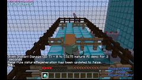
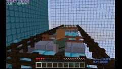
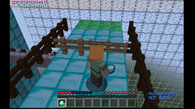
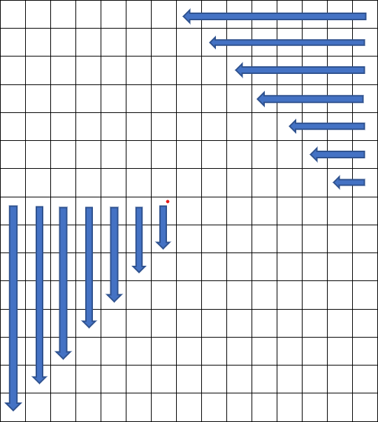

# Video Summary


# 1.Project Summary
Our project MatureAI is a survival game. Our map is composed of a 4 blocks wide running track surrounded by dark oak fences. Rewards and obstacles are randomly generated for each round. The goal of our agent is to survive as long as possible, to collect diamonds when moving forward, and to reach the target location. Depending on the obstacle, our agent learns to take appropriate actions, such as opening the gate, stepping on the stone and jumping over the fence. The agent is dropped at the start line of the track for each game, and we use Redstone circuitry to create explosions and destroy the road as time goes by, so the agent learns to move forward and reach the finish line, or it will die. To improve the performance of the agent, we customized the PPO trainer with PyTorch CNN model and optimized our reward function. Compared to the status report, the map is more complex, our agent bypasses more obstacles and survives much longer.


# 2. Learning Environment

### 2.1 Environment Summary 

Compared to the status report, we have a huge update in the final version. In the status report our environment is simple and deterministic, but for the final report we changed the map into more complex and stochastic environment. In the status report we planned to implement four levels of difficulty, but because of the limitation of Malmo platform (there is no dashing action for the agent) we only train our agent on the introductory level. To compensate the change, we added some interesting creatures and map generating mechanism, such as using continuous action space and random reward distribution. 

### 2.2 Obstacle Types

<p align="center">
    <b>1 Road Destruction(Difficulty: Easy, Deterministic)</b>
</p>

<p align="center">

</p>

The initially the agent will have 11.5 second to run before the first TNT explodes. For each obstacle, the agent will have additional 1.5 second to escape from the explosive. 

<p align="center">
    <b> 2 Simple Jumping( Difficulty: easy, Deterministic)</b>
</p>

<p align="center">

</p>

The agent needs to step onto the slab, perform the jump action, and walk through the gate. 'Stop action' is optional for this type of obstacle. 

<p align="center">
    <b> 3 Opening Door (Difficulty: medium, Stochastic)</b>
</p>

<p align="center">

</p>

The agent needs to perform 'open action', and immediately perform 'stop action' and walk through the gate. There will be only two doors generated randomly for the agent to open and the other two are fences that the agent need to move the corresponding gate and open it.


<p align="center">
    <b>4 Avoiding Fireball (Difficulty: hard, Stochastic)</b>
</p>

<p align="center">

</p>

The agent needs to avoid the fireballs that the ghost shoots, and also the fire after the explosion. Because our obstacles are made of wood, the fire will ignite the fences and the agent needs to avoid those as well. 

<p align="center">
    <b>5 Collecting Rewards(Difficulty: medium, Stochastic)</b>
</p>

Behind each types of obstacles, our map will distribute diamond randomly as reward. The agent needs to perform the correct action and claim the reward as soon as possible because of the following explosive and the fire balls will burn the reward. 


# 3. Approaches

### 3.1 Approach 1: Customize PPO Trainer
Compared to the status report, we customized PPO trainer with CNN network instead of the default model to let the agent learn spatial information of the environment. In our customized trainer class, we use PyTorch library and add three convolution layers to extract features from observation matrices. As our input matrices are not large, we use outputs from convolution layers without adding pooling layers in between and use RELU provided by PyTorch as the activation function. Compared to using linear function with default PPO trainer, our agent learns faster and more accurate under same number of steps.
```
 class MyModel(TorchModelV2, nn.Module):
     def __init__(self, *args, **kwargs):
         TorchModelV2.__init__(self, *args, **kwargs)
         nn.Module.__init__(self)

         self.conv1 = nn.Conv2d(4, 32, kernel_size=7, padding=3)
         self.conv2 = nn.Conv2d(32, 32, kernel_size=7, padding=3)
         self.conv3 = nn.Conv2d(32, 32, kernel_size=7, padding=3)
         self.policy_layer = nn.Linear(32*15*15, 5)
         self.value_layer = nn.Linear(32*15*15, 1)
         self.value = None

     def forward(self, input_dict, state, seq_lens):
         x = input_dict['obs']
         x = F.relu(self.conv1(x))
         x = F.relu(self.conv2(x))
         x = F.relu(self.conv3(x))
         x = x.flatten(start_dim=1)

         policy = self.policy_layer(x)
         self.value = self.value_layer(x)

         return policy, state

     def value_function(self):
         return self.value.squeeze(1)
```

(Maybe use flow chart instead of code)


### 3.2 Discussion


# 4 Heuristics

### 4.1 Reward Formula

For the final version, we consider several factors when giving our agent rewards. The reward formula is consist of two part:  **V(s) = P(s) + R(s)**


### 4.2 Discussion for Optimizing Reward 

As a survival game, it is intuitive to use survival time as rewards. We use “RewardForTimeTaken” in the XML documentation to give reward to agent by counting the time it survives. Since one tick in Minecraft is 0.05s in real world, we give 0.05 reward for every tick it survives in the game, which is the same as +1 reward per second.

Firstly, when observing the training process of the agent,  we notice that the agent tends to stay at the same spot and keep rotating its self instead of moving. Thus, to speed up the learning process we added small punishment for staying stationary. The same rationale applies we want the agent to move in the right direction, i.e. towards the destination, while still be able to make turns since it should bypass the obstacles and collect diamonds. So we have rewards such as “CloserToDest”, “FartherToDest”, “ReachWalls”. For “CloserToDest” and “FartherToDest”, we record the shortest distance to the destination when the agent moves. For “ReachBounds”, we check if the agent is touching the wall’s type, which is “dark_oak_fence”. If so, the agent gets -1 reward since moving to the wall is just wasting time and the agent may die. Additionally, we will give the agent +1 reward whenever it collects the diamond and +10 reward when it reaches the destination.

What is more, one issue we have for the status report is that the agent sometimes move around instead of moving forward, and it was finally killed by TNT bombs because of staying in the same area for too long. To resolve this issue and improve the performance of our agent, we add positive rewards for approaching the destination. This reward helps our agent learn to move forward and reach the finish line with less undesirable situations, such as moving around in circles and jumping off the boundary. 

```
 old_dest = self.current_to_dest  # Used for giving reward of moving to the destination
 old_shortest = self.shortest_to_dest
 new_dest = self.current_to_dest
 new_shortest = self.shortest_to_dest
 if old_dest < new_dest:
     reward -= 0.5
 elif old_dest > new_dest:
     reward += 0.5

 if old_shortest < new_shortest:
     reward -= 1
 elif old_shortest > new_shortest:
     reward += 1

 self.episode_return += reward
```

Our project will compare the z value of the current round and that from the last round. Whenever this shortest distance is updated, we give it +1 reward since it means the agent is moving towards the destination. On the other hand, if the agent is moving towards the opposite direction, we give it -0.5 reward. We do not give it -1 reward since moving towards the opposite direction may not always be a bad thing since it may on its way towards the diamond. From the evaluation result, we conclude that this reward undoubtfully contributes to improving survival time of our agent. 


### 4.3 Additional Approach: Customize rotate
Inspired by the extra credit part from assignment two, we customized rotate functionality of our agent. In the status report, our agent suffers from partial observability. The observation continues to assume the agent is centered and at right angles, which means that the agent’s knowledge of its own location has an orientation error. To make our observation more accurate but not too trivial and complex, we create a customized rotate function for our agent to mitigate orientation error. 

In our rotate function, we eliminate the orientation error of ±45 degrees. Our observation space is 15 x 15 x 5, and the following is our rotate logic and pseudocode. Please see our source code for more details. 

```
n = number of rotation times for the outermost observation space
for each layer of observation:
    from outside to inside observation space:
        rotate observation space n times
        update n to n - 1
```
<p align="center">

</p>
# 5 Evaluations


# 6 Resources Used
- [RLlib](https://docs.ray.io/en/master/rllib-training.html)
- [Pytorch Documentation](https://pytorch.org/docs/stable/index.html)
- [Customized RLlib Video](https://youtu.be/nMzoYNHgLpY)
- [Malmo API Documentation](https://microsoft.github.io/malmo/0.30.0/Documentation/index.html)
- [Malmo Tutorial](http://microsoft.github.io/malmo/0.30.0/Python_Examples/Tutorial.pdf)
- [OpenCV](https://opencv.org/)
- [Image Segmentation in OpenCV](https://realpython.com/python-opencv-color-spaces/)
- Assignment 2
