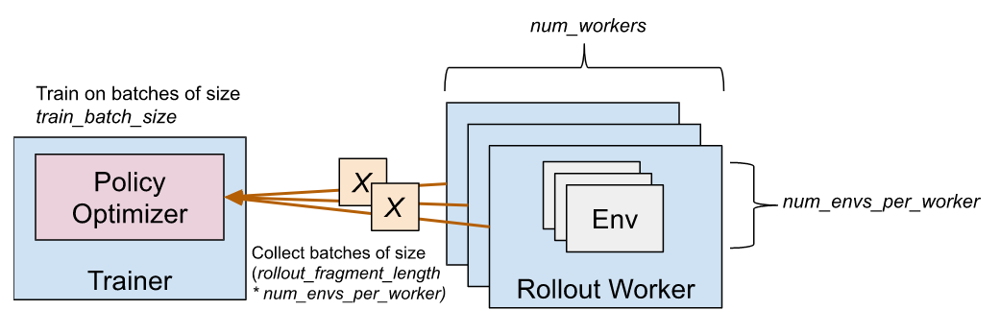
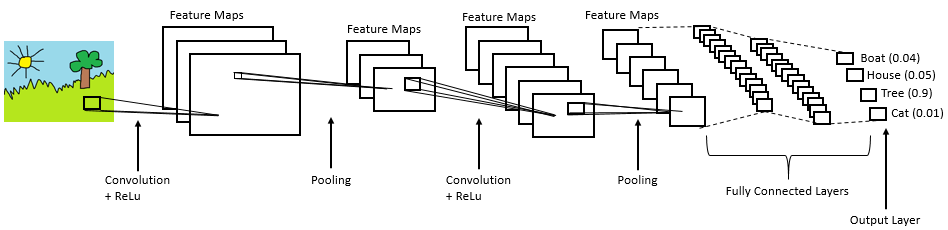

## 1. Video Summary
Video Link: [MatureAI Final Presentation](https://youtu.be/3gF5fztNZXI)
<iframe width="560" height="315" src="https://www.youtube.com/embed/3gF5fztNZXI" frameborder="0" allow="accelerometer; autoplay; clipboard-write; encrypted-media; gyroscope; picture-in-picture" allowfullscreen></iframe>

<br/><br/>

## 2. Project Summary
Our project MatureAI is a survival game. Our map is composed of a 4 blocks wide running track surrounded by dark oak fences. Rewards and obstacles are randomly generated for each round. The goal of our agent is to survive as long as possible, to collect diamonds when moving forward, and to reach the target location. Depending on the obstacle, our agent learns to take appropriate actions, such as opening the gate, stepping on the stone and jumping over the fence. The agent is dropped at the start line of the track for each game, and we use Redstone circuitry to create explosions and destroy the road as time goes by, so the agent learns to move forward and reach the finish line, or it will die. To improve the performance of the agent, we customized the PPO trainer with PyTorch CNN model and optimized our reward function. Compared to the status report, the map is more complex, our agent bypasses more obstacles and survives much longer.

<br/><br/>

## 3. Approaches
### 3.1 Environment Summary
Compared to the status report, we have a huge update in the final version. In the status report our environment is simple and deterministic, but for the final report we changed the map into more complex and stochastic environment. In the status report we planned to implement four levels of difficulty, but because of the limitation of Malmo platform (there is no dashing action for the agent) we only train our agent on the introductory level. To compensate the change, we added some interesting creatures and map generating mechanism, such as using continuous action space and random reward distribution. 

### 3.2 Obstacle Types
<p align="center">
    <b>1 Road Destruction(Difficulty: Easy, Deterministic)</b>
</p>

<p align="center">

</p>

The initially the agent will have 11.5 second to run before the first TNT explodes. For each obstacle, the agent will have additional 1.5 second to escape from the explosive. 

<p align="center">
    <b> 2 Simple Jumping( Difficulty: easy, Deterministic)</b>
</p>

<p align="center">

</p>

The agent needs to step onto the slab, perform the jump action, and walk through the gate. 'Stop action' is optional for this type of obstacle. 

<p align="center">
    <b> 3 Opening Door (Difficulty: medium, Stochastic)</b>
</p>

<p align="center">

</p>

The agent needs to perform 'open action', and immediately perform 'stop action' and walk through the gate. There will be only two doors generated randomly for the agent to open and the other two are fences that the agent need to move the corresponding gate and open it.


<p align="center">
    <b>4 Avoiding Fireball (Difficulty: hard, Stochastic)</b>
</p>

<p align="center">

</p>

The agent needs to avoid the fireballs that the ghost shoots, and also the fire after the explosion. Because our obstacles are made of wood, the fire will ignite the fences and the agent needs to avoid those as well. 

<p align="center">
    <b>5 Collecting Rewards(Difficulty: medium, Stochastic)</b>
</p>

Behind each types of obstacles, our map will distribute diamond randomly as reward. The agent needs to perform the correct action and claim the reward as soon as possible because of the following explosive and the fire balls will burn the reward. 

### 3.3 Customize PPO Trainer
In status report, we used PPO trainer with default parameters from rllib for reinforcement learning. The trainer class helps us train, checkpoint model, and compute actions. 
<p align="center">

</p>

For final report, we customized PPO trainer with CNN network instead of the default model to let the agent learn spatial information of the environment. Technically, deep learning CNN models pass input matrices through a series of convolution layers with filter kernals, pooling, fully connected layers and apply Softmax function to classify an object with probabilistic values between 0 and 1. The below figure is a complete flow of CNN to process an input and classifies the objects based on values.
<p align="center">

</p>

For our project, we use PyTorch library and add three convolution layers to better extract features from observation matrices. Implementing one-hot encoding, we separate observation matrices into 5 layers for observation matrices, since we have 5 different types of obstacles. As the observation size is 15 by 15, the actual sizes of our input matrices are (5, 15, 15). Therefore, for the first convolution layer, the input channel number is 5. Then we set the output channel number to 32, as we usually choose the power of 2, and 32 is a common choice. As our input matrices are not large, we use outputs from convolution layers directly without adding pooling layers in between and use RELU provided by PyTorch as the activation function. For the remaining 2 convolution layer, we keep the input and output channel the same, and finally flatten the output and our customized model is generated. Compared to using linear function with default PPO trainer, our agent learns faster and more accurate under same number of steps. The following is our CNN model. 

```
 class MyModel(TorchModelV2, nn.Module):
     def __init__(self, *args, **kwargs):
         TorchModelV2.__init__(self, *args, **kwargs)
         nn.Module.__init__(self)

         self.conv1 = nn.Conv2d(5, 32, kernel_size=7, padding=3)
         self.conv2 = nn.Conv2d(32, 32, kernel_size=7, padding=3)
         self.conv3 = nn.Conv2d(32, 32, kernel_size=7, padding=3)
         self.policy_layer = nn.Linear(32*15*15, 7)
         self.value_layer = nn.Linear(32*15*15, 1)
         self.value = None

     def forward(self, input_dict, state, seq_lens):
         x = input_dict['obs']
         x = F.relu(self.conv1(x))
         x = F.relu(self.conv2(x))
         x = F.relu(self.conv3(x))
         x = x.flatten(start_dim=1)

         policy = self.policy_layer(x)
         self.value = self.value_layer(x)

         return policy, state

     def value_function(self):
         return self.value.squeeze(1)
```

 
### 3.4 Rewards
**Reward Formula**

For the final version, we consider several factors when giving our agent rewards. The reward formula is consist of two part:  **V(s) = P(s) + R(s)**


<br/><br/>
**Reward Function Explanation and Optimization**

As a survival game, it is intuitive to use survival time as rewards. We use “RewardForTimeTaken” in the XML documentation to give reward to agent by counting the time it survives. Since one tick in Minecraft is 0.05s in real world, we give 0.05 reward for every tick it survives in the game, which is the same as +1 reward per second.

Then, when observing the training process of the agent,  we notice that the agent tends to stay at the same spot and keep rotating its self instead of moving. Thus, to speed up the learning process we added small punishment for staying stationary. The same rationale applies we want the agent to move in the right direction, i.e. towards the destination, while still be able to make turns since it should bypass the obstacles and collect diamonds. So we have rewards such as “CloserToDest”, “FartherToDest”, “ReachWalls”. For “CloserToDest” and “FartherToDest”, we record the shortest distance to the destination when the agent moves. Whenever this shortest distance is updated, we give it +1 reward since it means the agent is moving towards the destination. If the agent is moving towards the opposite direction, we give it -0.5 reward. We do not give it -1 reward since moving towards the opposite direction may not always be a bad thing since it may on its way towards the diamond. For “ReachBounds”, we check if the agent is touching the wall’s type, which is “dark_oak_fence”. If so, the agent gets -1 reward since moving to the wall is just wasting time and the agent may die.

```
 # Used for giving reward of moving towards the destination
 old_dest = self.current_to_dest
 old_shortest = self.shortest_to_dest
 new_dest = self.current_to_dest
 new_shortest = self.shortest_to_dest
 if old_dest < new_dest:
     reward -= 0.5
 elif old_dest > new_dest:
     reward += 0.5

 if old_shortest < new_shortest:
     reward -= 1
 elif old_shortest > new_shortest:
     reward += 1

 self.episode_return += reward
```

Finally, we give the agent +1 reward whenever it collects the diamond and +10 reward when it reaches the destination.

From the evaluation result, we conclude that these rewards undoubtfully contributes to improving survival time of our agent. 
 
### 3.5 Customize rotate
Inspired by the extra credit part from assignment two, we customized rotate functionality of our agent. In the status report, our agent suffers from partial observability. The observation continues to assume the agent is centered and at right angles, which means that the agent’s knowledge of its own location has an orientation error. To make our observation more accurate but not too trivial or complex, we create a customized rotate function for our agent to mitigate orientation error. 

In our rotate function, we eliminate the orientation error of ±45 degrees. Our observation space is (5, 15, 15), and the following is our rotate logic and pseudocode. Please see our source code for more details. 

```
n = number of rotation times for the outermost observation space
for each layer of observation:
    from outside to inside observation space:
        rotate observation space n times
        update n to n - 1
```

If we want to rotate the matrix by 45 degrees to the right, elements on the boundary of our observation matrix needs to be rotated 7 times to the left. Then inner elements next to the the boundary needs to be rotated 6 times, and we perform this rotation until we reach the center of the matrix. We did not divide the rotation angle into too small pieces. The first reason is that 90 cannot be perfectly divided by 14, and we have to round the result to determine rotation times. Meanwhile, dividing the rotation angle into too small pieces sometimes keep our agent changing its forward direction in the same spot without actually moving forward. The following is a graphic illustration of our customized rotate function. 

<p align="center">

</p>


<br/><br/>
## 4. Evaluations

### 4.1 Qualitative Evaluation
We qualitatively evaluate the performance of our agent through the video of the training process. At the beginning of the training process, we find the agent often moves aimlessly, i.e., moves towards the walls, makes meaningless turns, and moves backwards. Also, the agent has a hard time bypassing the obstacles and thus quickly dies after the TNT explodes. In this phase, the total reward for a task is about +10 since the agent has 6s before the first TNT explodes, which is about +6 rewards. After about 40,000 steps, the agent can mostly avoid touching the boundaries and has a sense that moving towards the destination can survive longer. But still, the agent has some trouble bypassing different kinds of obstacles and dies on their way to the finish line. During this phase, the total reward for a task is between +20 and +30. Finally, after 100,0000 steps, the agent gradually becomes an expert of the game and seldom takes useless actions. It will open the gate, jump over the fence, dodge the fireball, and collect the diamond on its way. Reaching the finish line is easy after 100,0000 steps.

### 4.2 Quantitative Evaluation
We quantitatively evaluate the performance of our agent through plotting the total rewards and survival time of each episode. We will use the agent performing random actions as our baseline, i.e. our trained model should perform much better than the agent with random actions. The higher the total rewards the agent gets, the longer it survives, the more diamonds it gets and the closer it is to the finish line. Moreover, since our setup is a survival game, we also plot purely the surivial time so that we can evaluate the survival time of the agent more directly. According to the first two plots below, it is clear that the agent learns overtime and has better performance. Both the plots of rewards and pure survival time have increasing trends. Compare the last plot with the first two, it is clear that the agent with random actions does not steadily increase its rewards returned over trainning.

<br/><br/>

Rewards Return
<p>

</p>

<br/><br/>

Pure Survival Time Return
<p>

</p>

<br/><br/>

Random Choice Return (Baseline)
<p>

</p>


# 5 Resources Used
- [RLlib](https://docs.ray.io/en/master/rllib-training.html)
- [Pytorch Documentation](https://pytorch.org/docs/stable/index.html)
- [Understanding of Convolutional Neural Network (CNN) — Deep Learning](https://medium.com/@RaghavPrabhu/understanding-of-convolutional-neural-network-cnn-deep-learning-99760835f148)
- [Customized RLlib Video](https://youtu.be/nMzoYNHgLpY)
- [Malmo API Documentation](https://microsoft.github.io/malmo/0.30.0/Documentation/index.html)
- [Malmo Tutorial](http://microsoft.github.io/malmo/0.30.0/Python_Examples/Tutorial.pdf)
- [OpenCV](https://opencv.org/)
- [Image Segmentation in OpenCV](https://realpython.com/python-opencv-color-spaces/)
- Assignment 2
