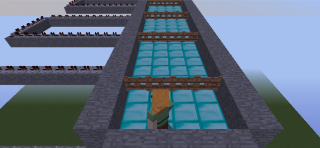

# Source code: [Github Repository](https://github.com/haodonq/MatureAI)

# Reports:
- [Proposal](proposal.html)
- [Status](status.html)
- [Final](final.html)

# Project Summury
MatureAI is a survival game. The goal of this project is training our agent to survive as long as possible and collect as many rewards as it can. We are inspired by the game Temple Run and would like to design a much more complex AI runner project with the help of deep Q-Learning algorithm. 
When the game start, our agent needs to collect as many golds and diamonds as possible while running forward. When collecting gold coins and diamonds, our agent also needs to bypass obstacles and not to fall off the cliffs. In addition, it cannot stay in the same location for too long, because this will trigger the TNT bomb and the bumb will destroy the road ahead. 

# Group Meeting Time
9pm - 10pm Tuesday and Thursday

[quickref]: https://github.com/mundimark/quickrefs/blob/master/HTML.md
