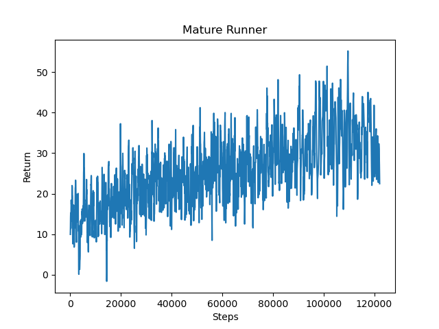

# Video Summury
Video Link: [MatureAI Presentation](https://youtu.be/HdYuLv545YY)
<iframe width="560" height="315" src="https://www.youtube.com/embed/HdYuLv545YY" frameborder="0" allow="accelerometer; autoplay; clipboard-write; encrypted-media; gyroscope; picture-in-picture" allowfullscreen></iframe>

# Project Summary

MatureAI is a survival game. The goal of this project is to train our agent to survive as long as possible and collects as many rewards as it can. We are inspired by the game Temple Run and would like to design a much more complex AI runner project with the help of the deep Q-Learning algorithm.  Our agent needs to collect golds and diamonds while running. When collecting rewards, our agent needs to bypass obstacles and not hit stones on both sides of the road. We are using use Redstone circuitry to create explosions and destroy the road as time goes by. At the same time, we will give our agent surviving time reward for moving forward.


# Approach

Given our relatively simple environment, we are using PPO trainer with default parameters from rllib for reinforcement learning. The trainer class helps us train, checkpoint model, and compute actions. Please see the image attached below as a reference to how the trainer works.

<p align="center">

</p>


Each observation is a Numpy array of size 5 X 5 X 2. When facing a gate, the agent will either open it or make it remain unopened. Our goal is to train our agent to open the gate each time it encounters one. If our agent did not not open it, it could not move forward and enter next area ahead. To imitate the basic game logic of Temple Run and help our agent learn to move forward, we set a time limit for TNT that under each area. If the time is up, TNT will explode, and the agent will fall off the track and die. 


### Obstacle Types

Currently we designed 4 levels of difficulty: Trainee, Introductory, Medium, and Advance. For the status report we will only handle the trainee level.

Trainee: It only contains fence gate. The agent needs to open the gate and walk through the gate.

<p align="center">

</p>

Introductory: It will contain fence gate and level 1 obstacle as show below. The agent needs to step onto the slab and jump.

<p align="center">

</p>


Medium: It will contain fence gate, level 1 obstacle and level 2 obstacles as show below. The agent needs to step onto the slab and jump with certain acceleration.

<p align="center">

</p>


Advance: It will contain all obstacles above and the agent needs to step onto the slab and jump with maximum acceleration.

<p align="center">

</p>

### Action Space
The action space is similar to the one from assignment2, and we use discrete action space for now, since environment is straightforward and simple. The "use 1" in action right now is to open the gate, so our agent will be able to move forward. 
```
self.action_dict = {
    0: 'move 1',  # Move one block forward
    1: 'use 1',   # Open the gate 
    2: 'turn 1',  # Turn 90 degrees to the right
    3: 'turn -1'  # Turn 90 degrees to the left
}
```

### Reward

As we need to evaluate performance based on survival time, we implemented the reward XML code in this way. 
```
<RewardForTimeTaken initialReward='0' delta='0.05' density='MISSION_END' />
```
Using RewardForTimeTaken flag, we are able to measure the exact survival time of our agent, and therefore give it a reward when the mission end. Because Minecraft uses ticks to measure time, which is 1/20 seconds in the real world, we set delta = 0.05, so the agent will have one positive survival reward per second. 

# Evaluation
To evaluate our model quantitatively, we set positive and negative rewards for touching specific blocks. We will evaluate the performance of our agent based on the cumulative value returned by our agent. Please see the code snip for details. 
```
<RewardForTouchingBlockType>
  <Block type='stone' reward='-1'/>
  <Block type='sandstone' reward='-0.5'/>
  <Block type='emerald_block' reward='10'/>
  <Block type='jungle_fence_gate' reward='-1'/>
</RewardForTouchingBlockType>
```

Based on the reward system described in Approach and logic designed above, we have the reward graph below. According to the graph, we could see that our agent is learning to grab golds and diamonds and avoid hitting obstacles. 

<p align="center">

</p>

To evaluate our model qualitatively, we will keep track of the action taken by our agent. It is expected to survive as long as possible, which means that our agent should bypass obstacles and avoid hitting stones on both sides of the road, without taking greater risk of dying.

# Remaining Goals and Challenges

## Remaining Goals
In the next four weeks, we will change discrete action space to continuous action space as our environment will get more complex. For now, we make a simple map to ensure our agent will avoid hitting obstacles and collect golds. In the final version, we will design more complex maps for the agent and add more types of obstacles.  At the same time, our ambition is to use raw pixels instead of world state observation. This requires color segmentation and distance estimation, which are the main challenge we face in the next few weeks. 

## Challenges
When we try to use computer vision and raw pixels, we realize that it is more complex than we initially thought.  The first challenge is using computer vision to detect surrounding objects. We will implement a color segmentation method to quickly detect the boundary of each object, and separate them using different colors. We need to be careful when setting threshold values because the colors of some single blocks are composed of multiple colors, and we need to treat them as a whole and replace them with the same color. The second challenge is to use computer vision to detect obstacles. When trying to implement computer vision with opencv, we have to find the distance obstacles and our agent, then reflect this distance in our map. This step requires careful calculation so our agent will know exactly where the obstacles lie. 

# Resources Used
- [OpenCV](https://opencv.org/)
- [RLlib](https://docs.ray.io/en/master/rllib-training.html)
- Malmo Tutorial
- Assignment 2
- Stack Overflow
